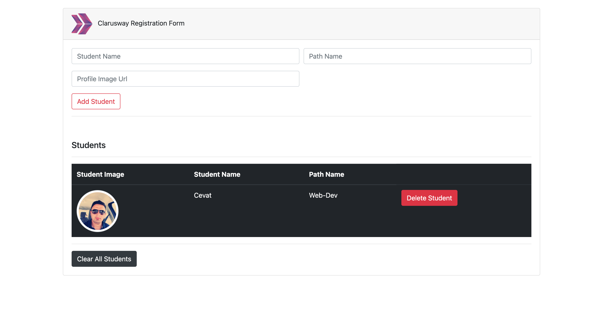

# Form_Registration_Project_JS

## Table of contents

- [Overview](#overview)
  - [Screenshot](#screenshot)
  - [Links](#links)
- [My process](#my-process)
  - [Built with](#built-with)
  - [What I learned](#what-i-learned)
  - [Continued development](#continued-development)
  - [Useful resources](#useful-resources)
- [Author](#author)
- [Acknowledgments](#acknowledgments)

## Overview

### Screenshot



### Links

- Live Site URL: [Live site URL](https://morcicek.github.io/Form_Registration_Project_JS/)

## My process

### Built with

- Semantic HTML5 markup
- CSS custom properties
- [Bootstrap](https://getbootstrap.com/) - CSS library

### What I learned

In this project mostly i learned JS DOM Manipulation and JS Event types...

To see how you can add code snippets, see below:

```html
<div class="form-group col-md-6">
  <input
    class="form-control"
    type="text"
    name="name"
    id="name"
    placeholder="Student Name"
  />
</div>
```

```bootstrap
<link
      rel="stylesheet"
      href="https://maxcdn.bootstrapcdn.com/bootstrap/4.0.0/css/bootstrap.min.css"
      integrity="sha384-Gn5384xqQ1aoWXA+058RXPxPg6fy4IWvTNh0E263XmFcJlSAwiGgFAW/dAiS6JXm"
      crossorigin="anonymous"
    />
```

```js
const removeLoading = () => {
  setTimeout(() => {
    loading.style.display = 'none';
  }, 1000);
};
};
```

### Useful resources

- [MDN](https://developer.mozilla.org/en-US/) - This helped me for finding some method in JS.

## Author

- gitHub - [Mehmet Cevat Morcicek](https://github.com/morcicek)
- Twitter - [@morcicek_m](https://twitter.com/home)
